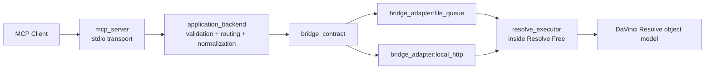

# Architecture

## Summary

`DavinciFreeMcp` is designed as an MCP-first system for **DaVinci Resolve Free** with a strict separation between:

- the MCP-facing tool layer
- the application/backend logic
- the internal Resolve execution environment

This separation is necessary because Resolve Free should not be treated as a reliable target for Studio-style external scripting. The backend must interact with Resolve through a controlled bridge to an internal executor.

## Target Architecture



## Layers

### 1. `mcp_server`

Responsibilities:

- expose tools over `stdio` for MVP
- define JSON-schema-friendly inputs and outputs
- translate MCP tool calls into backend commands
- keep MCP concerns separate from Resolve-specific logic

### 2. `application_backend`

Responsibilities:

- validate tool input with Pydantic models
- map tool calls to backend commands
- enforce preconditions and error normalization
- orchestrate bridge calls
- convert executor responses into stable MCP outputs

### 3. `bridge_contract`

The bridge contract is transport-agnostic and must stay stable even if adapters change.

Command envelope:

```json
{
  "request_id": "uuid-or-monotonic-id",
  "command": "timeline_list",
  "target": {
    "project": "optional-project-name",
    "timeline": "optional-timeline-id-or-name"
  },
  "payload": {},
  "timeout_ms": 5000,
  "context": {
    "caller": "mcp_server",
    "tool_name": "timeline_list"
  }
}
```

Result envelope:

```json
{
  "request_id": "same-as-command",
  "ok": true,
  "data": {},
  "error": null,
  "warnings": [],
  "meta": {
    "bridge": "file_queue",
    "executor_version": "dev"
  }
}
```

Required interface operations:

- `submit_command(command) -> submission_handle`
- `await_result(request_id, timeout_ms) -> result`
- `health_check() -> status`
- `cancel(request_id)` or explicit `not_supported_in_mvp`

### 4. `bridge_adapters`

The system should support multiple adapters behind the same contract.

#### `file_queue`

Recommended MVP adapter.

Expected behavior:

- backend writes JSON command files into a spool/request directory
- internal executor polls or watches for commands
- executor writes JSON results into a spool/result directory
- adapter handles correlation, stale file cleanup, and timeout mapping

#### `local_http`

Optional alternative adapter.

Expected behavior:

- internal executor exposes or consumes a local-only HTTP endpoint
- command and result schema is identical to `file_queue`
- backend does not gain special privileges from this adapter

### 5. `resolve_executor`

The executor is an internal script or runtime that runs inside Resolve Free.

Responsibilities:

- obtain Resolve handle from the embedded environment
- dispatch known command names to handlers
- resolve objects on demand
- serialize results to JSON-safe primitives
- enforce safe operational boundaries
- report structured failures

## Data Flow

1. MCP client calls a tool.
2. `mcp_server` validates the MCP input shape and forwards the request to the backend.
3. `application_backend` builds a backend command envelope.
4. backend calls a bridge adapter through the shared `bridge_contract`.
5. adapter sends the command to the internal executor.
6. `resolve_executor` resolves the current project/timeline/media context and runs a constrained action.
7. executor returns a structured result envelope.
8. backend normalizes warnings/errors and maps the response to the tool output schema.
9. `mcp_server` returns the final MCP tool result.

## Why the Backend Must Not Call Resolve Directly

The backend must not assume it can safely call Resolve from an external Python process in Free mode. That pattern is strongly associated with Studio/external scripting and would create a false architectural baseline.

The backend therefore treats Resolve as an internal execution target accessed indirectly through the bridge.

## Executor Design Constraints

The internal executor should stay intentionally narrow.

It should:

- support only approved command handlers
- avoid long-lived in-memory object assumptions where possible
- prefer re-resolution of objects from stable identifiers
- return JSON-safe data only
- avoid blocking UI-sensitive flows for long-running work

## Error Model

The backend should normalize executor and bridge failures into stable categories:

- `bridge_unavailable`
- `resolve_not_ready`
- `no_project_open`
- `object_not_found`
- `unsupported_in_free_mode`
- `validation_error`
- `execution_failure`
- `timeout`

## Future Extension Path

High-level AI tools should be built only after the low-level substrate is stable.

Planned layering:

- low-level primitive tools
- composite workflow tools
- AI-assisted tools

Future additions should compile to stable low-level commands instead of bypassing the backend and bridge.
